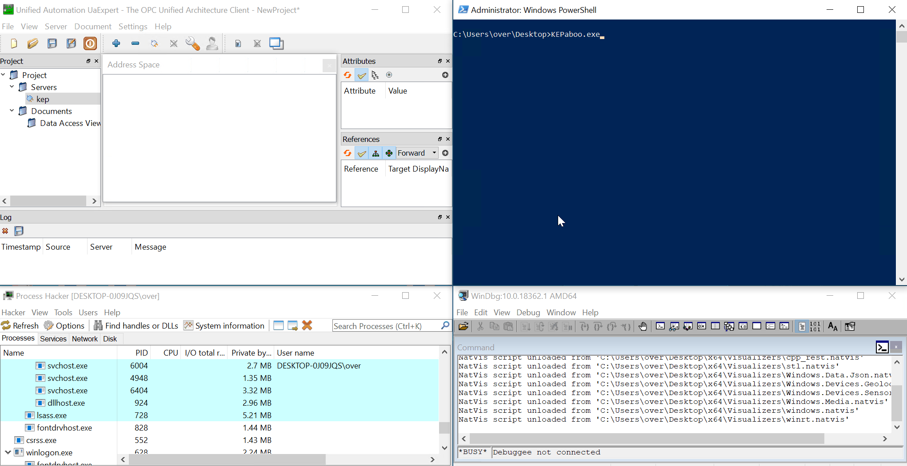

# KEPaboo - Neutralize KEPServerEX anti-debugging techniques


<p align='center'>

</p>

## Overview

`KEPaboo` is a utility that neuters anti-debugging techniques used by [KEPServerEX](https://www.ptc.com/en/products/kepware/kepserverex) to prevent people from debugging their code. It is not a security issue, and it has been tested against on the version `6.12.361.0` (February 2023) on Windows 10 64-bit.

## Usage
Download `KEPaboo` binaries from the Releases section and run it as an **Administrator** to register it as `KEPServerEX`'s `Debugger` via [Image File Execution Options](https://www.malwarebytes.com/blog/news/2015/12/an-introduction-to-image-file-execution-options). By doing so, KEPaboo can start automatically when KEPServerEx is launched.

When you start the KEPServerEx service, KEPaboo acts as a small proxy layer that performs the following tasks:

- Starts the `server_runtime.exe` process and debugs it
- Hooks into [NtSetInformationThread](https://learn.microsoft.com/en-us/windows-hardware/drivers/ddi/ntifs/nf-ntifs-ntsetinformationthread) and [NtQueryInformationProcess](https://learn.microsoft.com/en-us/windows/win32/api/winternl/nf-winternl-ntqueryinformationprocess) by modifying `ntdll`'s [Export Address Table](https://learn.microsoft.com/en-us/archive/msdn-magazine/2002/march/inside-windows-an-in-depth-look-into-the-win32-portable-executable-file-format-part-2)
- Listens for a debug event generated by an `INT 2D` instruction, and patches the code to restore the expected execution flow
- Detaches itself from the server process, allowing you to attach your favorite debugger
- Waits until the server process ends

To unregister `KEPaboo` without rebooting, run it as an **Administrator** again, and it will detect that it was previously registered and remove itself.

**Note that the registry modification is volatile, which means that it will disappear after a reboot. If you want to use `KEPaboo` again, you will need to re-run it.**

## Build and debug

Clone the repository with:

```
(base) > git clone https://github.com/0vercl0k/KEPaboo.git
```

You can open the Visual Studio solution `KEPaboo.sln` or build it via the command line with:

```
(base) KEPaboo>msbuild /p:Configuration=Release src\KEPaboo.sln
Microsoft (R) Build Engine version 16.7.0+b89cb5fde for .NET Framework
Copyright (C) Microsoft Corporation. All rights reserved.

[...]

Build succeeded.
    0 Warning(s)
    0 Error(s)

Time Elapsed 00:00:00.42
```

Use the `debug` configuration, attach a debugger to `KEPaboo.exe`. You should see debug outputs in the console window of the debugger.

## Authors
* Axel '[0vercl0k](https://twitter.com/0vercl0k)' Souchet
